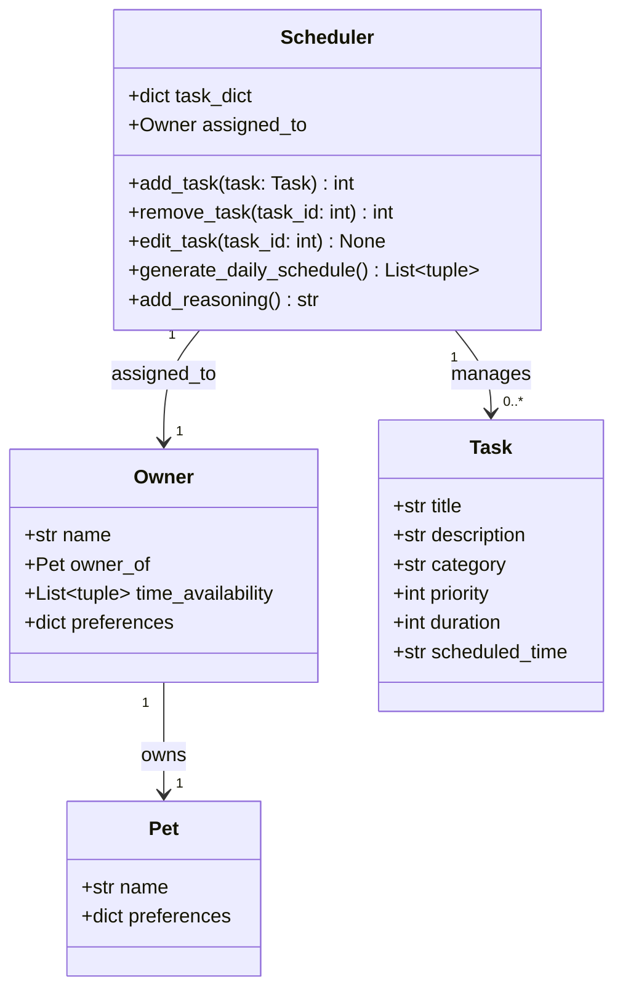

# PawPal+ 

You are building **PawPal+**, a Streamlit app that helps a pet owner plan care tasks for their pet.

## Scenario

A busy pet owner needs help staying consistent with pet care. They want an assistant that can:

- Track pet care tasks (walks, feeding, meds, enrichment, grooming, etc.)
- Consider constraints (time available, priority, owner preferences)
- Produce a daily plan and explain why it chose that plan

Your job is to design the system first (UML), then implement the logic in Python, then connect it to the Streamlit UI.

## What you will build

Your final app should:

- Let a user enter basic owner + pet info
- Let a user add/edit tasks (duration + priority at minimum)
- Generate a daily schedule/plan based on constraints and priorities
- Display the plan clearly (and ideally explain the reasoning)
- Include tests for the most important scheduling behaviors

## Structure

```
Owner
    Attributes
        name: str
        owner_of: Pet
        time_availability: List[tuple]
            # e.g., [("11:00", "16:00")] in 24-hour time
        preferences: dict
            # dictionary containing the activities maps to values from 1-3 representing their preferences

Pet
    name: str
    preferences: dict
        # dictionary containing the activities maps to values from 1-3 representing their preferences. Activities includes: walks, feeding, meds, play, grooming

Task
    title: str
    description: str
    category: str
    priority: int
        # 1-3
    duration: int
    scheduled_time: str
        # the date it's scheduled 

Scheduler
    Attributes:
        task_dict: dict
        assigned_to: Owner

    Methods: 
        edit_task(task_id: int) -> None
            # edit a specific task based on its ID
        add_task(task: Task) -> task_id
            # add a new task into the schedule and assigns it an id
        remove_task(task_id: int) -> task_id: int
            # remove a task by its id and returns it
        generate_daily_schedule() -> List[tuple]
            # generates and returns a daily schedule based on constraints
            # e.g., [(time, Task)]
        add_reasoning() -> str
            # returns a plain-English explanation of why tasks were scheduled as they were

```

## UML Diagram

