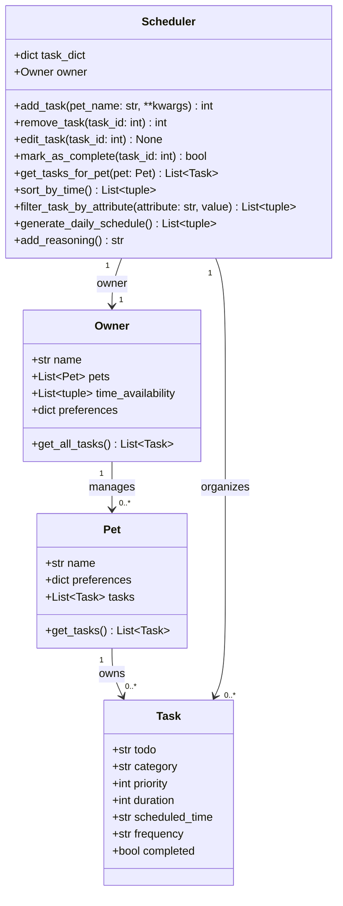

# PawPal+ 

You are building **PawPal+**, a Streamlit app that helps a pet owner plan care tasks for their pet.

## Scenario

A busy pet owner needs help staying consistent with pet care. They want an assistant that can:

- Track pet care tasks (walks, feeding, meds, enrichment, grooming, etc.)
- Consider constraints (time available, priority, owner preferences)
- Produce a daily plan and explain why it chose that plan

Your job is to design the system first (UML), then implement the logic in Python, then connect it to the Streamlit UI.

## What you will build

Your final app should:

- Let a user enter basic owner + pet info
- Let a user add/edit tasks (duration + priority at minimum)
- Generate a daily schedule/plan based on constraints and priorities
- Display the plan clearly (and ideally explain the reasoning)
- Include tests for the most important scheduling behaviors

## Structure

```
Task
    Attributes:
        todo: str
        category: str
            # matches preference keys: "walks", "feeding", "meds", "play", "grooming"
        priority: int
            # 1-3; auto-set by Scheduler.add_task() from pet.preferences[category], never passed directly
        duration: int
            # in minutes
        scheduled_time: str
            # the date it's scheduled, e.g., "2026-03-15"
        frequency: str
            # how often the task recurs, e.g., "daily", "weekly", "once"
        completed: bool
            # whether the task has been completed

Pet
    Attributes:
        name: str
        preferences: dict
            # activities mapped to values 1-3: walks, feeding, meds, play, grooming
        tasks: List[Task]
            # tasks belonging to this pet

    Methods:
        get_tasks() -> List[Task]
            # return all tasks for this pet

Owner
    Attributes:
        name: str
        pets: List[Pet]
            # all pets this owner manages (was owner_of: Pet)
        time_availability: List[tuple]
            # e.g., [("11:00", "16:00")] in 24-hour time
        preferences: dict
            # activities mapped to values 1-3

    Methods:
        get_all_tasks() -> List[Task]
            # returns all tasks across all pets

Scheduler
    Attributes:
        task_dict: dict
            # maps task_id (int) -> Task, aggregated across all pets
        assigned_to: Owner

    Methods:
        add_task(pet_name: str, **kwargs) -> task_id
            # factory method: looks up pet by name, creates a Task from kwargs using setattr,
            # auto-sets priority from pet.preferences[category], stores on pet and in task_dict
        remove_task(task_id: int) -> task_id: int
            # remove a task by its id from task_dict and from its pet's tasks list, returns the id
        edit_task(task_id: int) -> None
            # edit a specific task based on its ID
        get_tasks_for_pet(pet: Pet) -> List[Task]
            # retrieve all scheduled tasks belonging to a specific pet
        sort_by_time() -> List[tuple]
            # returns list of (task_id, Task) from task_dict sorted by scheduled_time ascending
            # tasks with no scheduled_time are placed at the end
        filter_task_by_attribute(attribute: str, value=None) -> List[tuple]
            # returns list of (task_id, Task) filtered by a task attribute or "pet_name"
            # if value is None, returns tasks where the attribute is truthy
            # e.g., filter_task_by_attribute("completed", False) -> incomplete tasks
            #        filter_task_by_attribute("pet_name", "Buddy") -> tasks for pet "Buddy"
        generate_daily_schedule() -> List[tuple]
            # generates and returns a daily schedule based on constraints
            # e.g., [(time, Task)]
        add_reasoning() -> str
            # returns a plain-English explanation of why tasks were scheduled as they were

```

## UML Diagram

